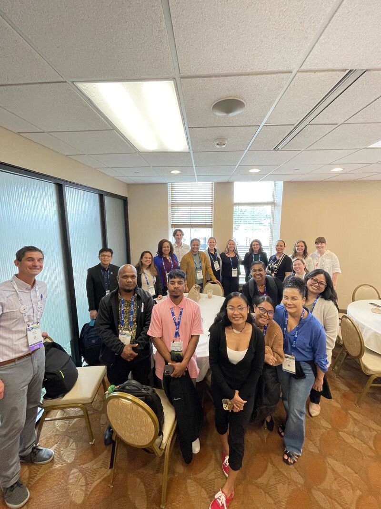

# Aloha Kahuina — Interactive Cover Letter

A single-page interactive cover letter built with [Quarto](https://quarto.org/) for a Public Health Associate application to [Kahuina Consulting](https://kahuina.com).

## Project Structure

```
aloha-kahuina/
├── _quarto.yml      # Quarto project configuration
├── styles.scss      # Custom Hawaiian Modernization theme
├── index.qmd        # Main document (all copy, R code, and layout)
├── images/          # Place your conference photo here
├── docs/            # Rendered output (auto-generated, serves GitHub Pages)
└── README.md        # This file
```

## Prerequisites

You need the following installed:

1. **R** (≥ 4.3) — [https://cran.r-project.org/](https://cran.r-project.org/)
2. **Quarto** (≥ 1.4) — [https://quarto.org/docs/get-started/](https://quarto.org/docs/get-started/)
3. **R packages**:

```r
install.packages(c("reactable", "htmltools", "knitr", "rmarkdown"))
```

## Build & Preview

```bash
# From the project root:
quarto preview        # Live preview with hot-reload
quarto render         # Build to docs/ folder
```

## Deploy to GitHub Pages

1. **Create a new GitHub repo** (e.g., `aloha-kahuina`).
2. Push this entire project to the repo.
3. Go to **Settings → Pages** in your repo.
4. Under **Source**, select **Deploy from a branch**.
5. Set the branch to `main` and the folder to `/docs`.
6. Click Save. Your site will be live at `https://jakebharmon.github.io/aloha-kahuina/` within a few minutes.

## Adding Your Conference Photo

1. Place your photo in the `images/` folder (e.g., `images/cste_pacific_island.jpg`).
2. In `index.qmd`, find the `.photo-placeholder` div in the "Health Equity in Practice" section.
3. Replace the entire `::: {.photo-placeholder} ... :::` block with:

```markdown
{fig-alt="Jake Harmon with Pacific Island epidemiologists at the CSTE Annual Conference" width="100%"}
```

4. Re-render with `quarto render`.

## Customization Notes

- **Colors**: All theme colors are defined as SCSS variables at the top of `styles.scss`. Adjust `$forest-deep`, `$sunset-warm`, `$ocean-teal`, etc. to taste.
- **Fonts**: The project uses Google Fonts (DM Sans, Playfair Display, JetBrains Mono). These load from the CDN — no local files needed.
- **Code visibility**: All R code blocks use `code-fold: true` by default (set in `_quarto.yml`). Readers can expand them to see the source.

## License

This is a personal application document. Not intended for redistribution.
